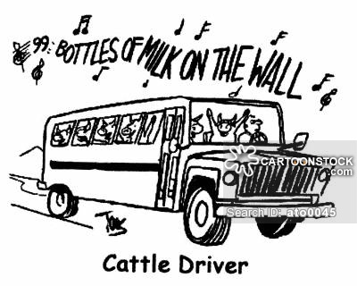

# nyomi feladatok

Töltsd le vagy forkold a repository-t és készítsd el az alábbi nyomi feladatokat! :)
A három feladatot a három "üres" mappába el is tudod helyezni. 
Az általános követelmények közé tartozik, hogy unit teszteket is írnod kell az kódokhoz, de azt most nem várom el, hogy TDD-vel. De persze ha van hozzá kedved, akkor hajrá! :)
Jahh és ne feledd, hogy bármi bármikor változhat.... ;) 
(A feladatok nem nehézségi sorrendben vannak, de kérlek, hogy most ebben a sorrendben csináld majd meg őket!)

A feladatok leírását [itt](http://practice.floppylab.com/pont/simple-exercises) is meg tudod nézni.

## 0. morse coder

  - van egy [morse.in](/data/morse.in) nevű fájl mely tartalmazza az ábécét segítségképpen
  - a feladat az, hogy én, mint felhasználó megadok egy betűt, szót vagy hosszabb szöveget, és vissza szeretném kapni kódolt megfelelőit
  - legyen szép! :)
  

  
## 1. 99 bottles of beer

  - írd ki a fenti megnevezett dalt! :)
  - legyen szép! :)
  

## 2. collatz conjecture
  - ha páros oszd el kettővel, ha páratlan szorozd meg hárommal és adj hozzá egyet
  - ha elég sokáig csinálod bármilyen kiinduló számból eljutsz az egyig (itt álj is meg)
  - a feladat az, hogy én, mint felhasználó, mondok egy számot, és meg kell mondani róla, hogy hány lépés után éri el az egyet	
  
